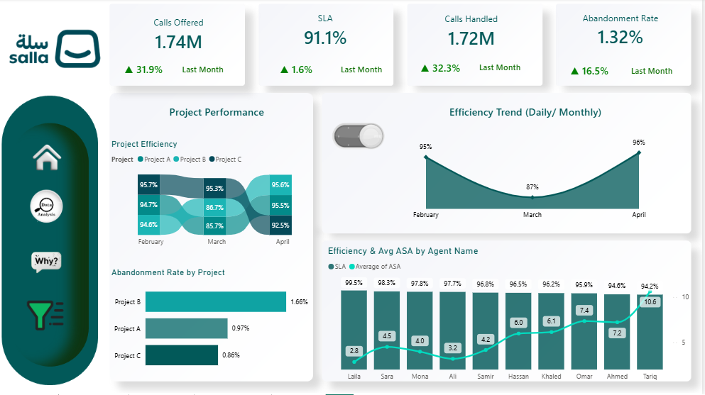

📞 Salla-Call-Center-Performance-Dashboard

Power BI dashboard analyzing call center operations, SLA trends, abandon rates, and agent performance across multiple projects.

---

## 📊 Overview
This project presents an interactive Power BI dashboard designed to analyze the performance of three call center projects (A, B, and C) over a three-month period (February, March, and April).

The dashboard focuses on monitoring SLA performance, identifying factors affecting abandon rates, evaluating agent efficiency, and supporting operational decision-making through interactive visualizations and what-if analysis.

---

## 🎯 Objectives
- Monitor SLA trends across projects
- Analyze abandon rate patterns
- Evaluate agent performance
- Identify operational bottlenecks
- Support decision-making using what-if scenarios

---

## 📊 Key KPIs
- SLA Achievement
- Calls Handled
- Calls Offered
- Abandonment Rate

---

## 📊 Key Insights
- Project B recorded the highest abandon rate among all projects.
- Saturdays in February and March showed noticeably high abandon rates.
- Operational performance improved significantly in April.
- SLA trends varied across projects, highlighting differences in operational efficiency.
- Agent-level analysis helped identify performance gaps affecting customer experience.

---

## 💡 Recommendations
- Increase staffing during peak periods, especially weekends.
- Optimize Average Speed of Answer (ASA) to reduce abandon rates.
- Monitor underperforming projects using real-time SLA tracking.
- Use forecasting and what-if analysis for workforce planning.

---
## 🔗 Project Sharing

👉 LinkedIn Case Study: (https://www.linkedin.com/posts/aml-ghazy-b1a50b3a4_powerbi-businessintelligence-datavisualization-ugcPost-7432173269048352768-RiFP?utm_source=share&utm_medium=member_desktop&rcm=ACoAAGMIDIYBHodAL2wtNlFwkDPUWM0DzigmRgk)
---

## 🛠️ Tools Used
- Power BI  
- Data Visualization  
- DAX  
- What-if Parameters  
- Drill-through Analysis  

